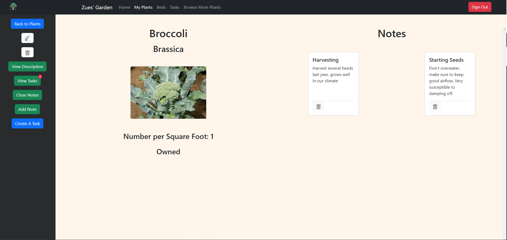
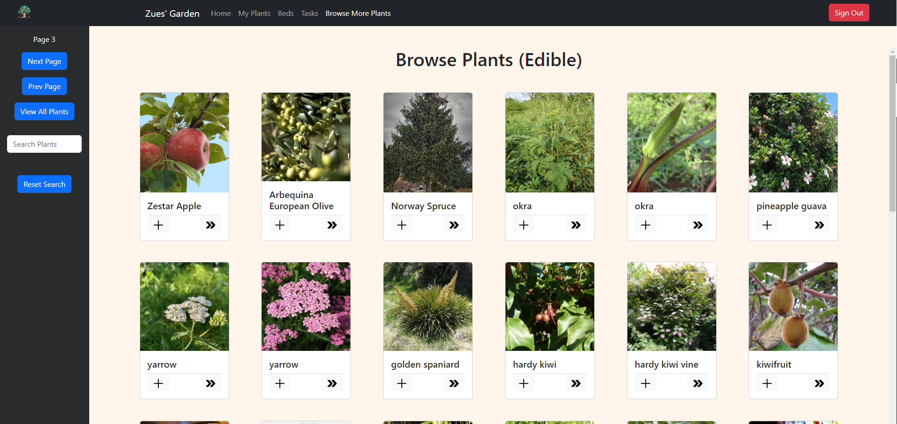
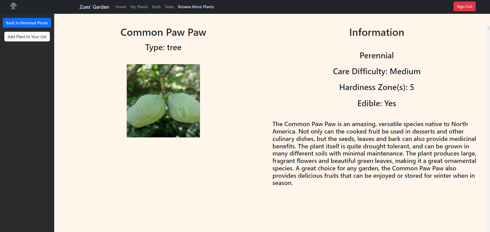
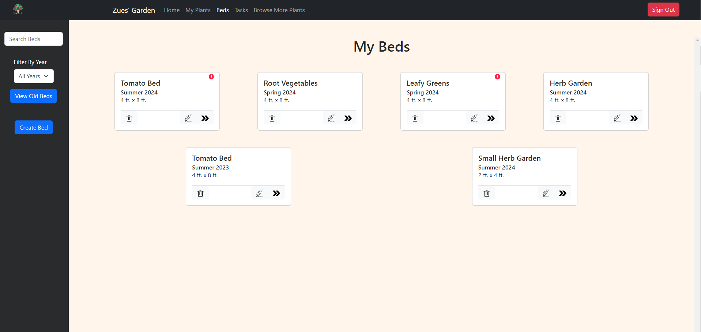

# Plants
## Overview
  This full stack app is for the hobby gardener who needs to keep track of the many moving parts that it takes to maintain a garden. A user is able to create plants, raised beds, and tasks. A user can also add notes to document extra information needed for a plant or raised bed, such as special care requirements or watering conditions. Plants added to a users profile can be used to create and plan raised beds for the next season. Users can also keep old beds documented to see what worked and what didn't. Next, a user can create tasks with a deadline and associate them with a plant or raised bed, so they can see what needs to get done in their garden and when. The app is also connected to Perenual which gives access to a huge database of unique plants that a user can explore and if they find anything interesting, they can add it to their own list.

## Deploy
[Plants App](raised-beds.netlify.app)

## Target User
 This app is for gardeners with big and small gardens alike who want to plan and keep track of their growing seasons

## Features
- Sign in/out via Google Authentication
- User specific data management
- Full CRUD on plants
- Full CRUD tasks to keep track of deadlines
- Set the priority level of a task to keep you focused on what matters most
- Associate tasks with a plant or raised bed (or both), and be alerted when that particular item has a task that needs to be done
- Special alerts for tasks that are overdue or coming due soon
- Full CRUD on raised beds
- Raised beds are based on square foot gardening, with each square representing one foot
- Add and remove plants from your raised beds to help you plan your next season
- Create notes for raised beds and plants to keep track of any extra information of special instructions for that item such as watering conditions or how much you harvested from a bed
- Using the Perenual API, users can interact with a massive database of plants to search for new plants or find extra information for their current ones
- Users can add plants from the Perenual database to their personal collection

## Screenshots

## Wireframe
[Figma Wireframe](https://www.figma.com/file/AbOlFV3K1tQg0UalAyhkkm/Plants?type=design&node-id=0-1&mode=design&t=hVdyxheIQOWGHnzM-0)

## ERD
[ERD Link](https://lucid.app/lucidchart/7f511c4d-c667-4537-9532-9f98f29c7902/edit?viewport_loc=1430%2C-1531%2C3072%2C1515%2C0_0&invitationId=inv_48c2e3dc-6d48-4078-b9d9-8d42bc35c09d)

## Project Board
[Github Project Board](https://github.com/users/tjpenc/projects/7/views/1)

## Start App
  Project uses endpoints from the repository PlantsAPI to call and query data
  Clone PlantsAPI repository, install EF Core, and database update to create your personal database
  Use npm run dev to start this project

## Technologies
  - C# / .NET 
  - Next.js
  - React
  - Bootstrap
  - Firebase Authentication
