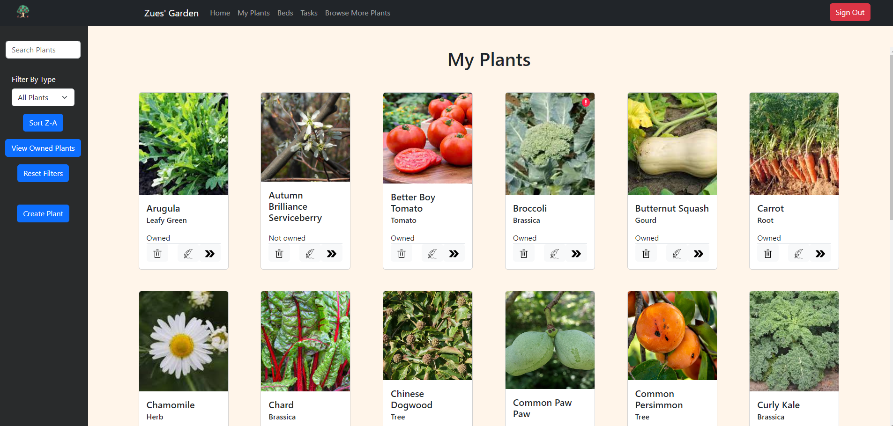

# Plants
## Overview
  This full stack app is for the hobby gardener who needs to keep track of the many tasks, plants, and beds that they have. A user is able to create tasks and set deadlines for themselves, and mark when the tasks have been completed. A user can also create plants to keep track of what plants they have in their inventory or even any plants they may want to own in the future. Further, this app acts as a raised bed planner. A user can use the plants they have created, and plan out a raised bed with those plants. All data is user specific, so you will never encounter another users data. 

## Deploy
[Plants App](raised-beds.netlify.app)

## Target User
 This app is for gardeners with big and small gardens alike who want to plan and keep track of their growing seasons

## Features
- Sign in/out via Google Authentication
- Create a plant and give it a name, description, and symbol to appear as in your raised beds
- Delete and edit plants that you do not have anymore
- Create tasks and reminders for your garden so you can see what you need to do, and the upcoming deadlines of when they are due
- Mark tasks as complete, and see a log of all you have accomplished in your garden
- Create and keep track of multiple raised beds
- Raised beds are based on square foot gardening, with each square representing one foot
- Add and remove plants from your raised beds to help you plot your next season

## Screenshots

## Wireframe
[Figma Wireframe](https://www.figma.com/file/AbOlFV3K1tQg0UalAyhkkm/Plants?type=design&node-id=0-1&mode=design&t=hVdyxheIQOWGHnzM-0)

## ERD
[ERD Link](https://lucid.app/lucidchart/7f511c4d-c667-4537-9532-9f98f29c7902/edit?viewport_loc=1430%2C-1531%2C3072%2C1515%2C0_0&invitationId=inv_48c2e3dc-6d48-4078-b9d9-8d42bc35c09d)

## Project Board
[Github Project Board](https://github.com/users/tjpenc/projects/7/views/1)

## Start App
  Project uses endpoints from the repository PlantsAPI to call and query data
  Clone PlantsAPI repository, install EF Core, and database update to create your personal database
  Use npm run dev to start this project

## Technologies
  - C# / .NET 
  - Next.js
  - React
  - Bootstrap
  - Firebase Authentication
